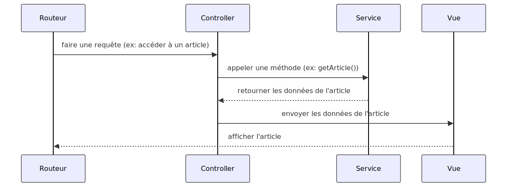

# Base de données avec PHP
---


---
## Les Repository

Appelé par les services, ils ont comme rôle de faire le lien entre la source de données et l'application.

---
## Le constructeur du Repository 
### le Pattern Singleton

```php
<?php

require_once '../app/core/Repository.php';


class CategoryRepository
{
    private $pdo;

    public function __construct()
    {
        $this->pdo = Repository::getInstance()->getPDO();
    }
    
}
```

---
## Le constructeur du Repository
### le Pattern Singleton
```php
<?php

require_once '../config/config.php';

class Repository {
    private static $instance = null;  // Instance unique de la classe
    protected $pdo;

    // Le constructeur est maintenant privé pour empêcher une instanciation directe
    private function __construct() {
        $this->pdo = $this->getDatabaseConnection();
    }

    // Méthode pour obtenir l'instance unique de la classe (Singleton)
    public static function getInstance() {
        if (self::$instance === null) {
            self::$instance = new Repository();
        }
        return self::$instance;
    }

    // Fonction pour se connecter à la base de données
    protected function getDatabaseConnection() {
        $dsn = 'pgsql:host=' . DB_HOST . ';port=' . DB_PORT . ';dbname=' . DB_NAME;

        try {
            $pdo = new PDO($dsn, DB_USER, DB_PASS);
            $pdo->setAttribute(PDO::ATTR_ERRMODE, PDO::ERRMODE_EXCEPTION);  // Mode d'erreur
            return $pdo;
        } catch (PDOException $e) {
            die('Erreur de connexion : ' . $e->getMessage());
        }
    }

    // Méthode pour obtenir la connexion PDO
    public function getPDO() {
        return $this->pdo;
    }

    // Empêche le clonage de l'objet
    private function __clone() {}

}
```
---
## Execution d'une requête
```php
public function findAll(): array
{
    $stmt = $this->pdo->query("SELECT * FROM category");
    $categories = [];
    while ($row = $stmt->fetch(PDO::FETCH_ASSOC)) {
        $categories[] = $this->createCategoryFromRow($row);
    }
    return $categories;
}
```

---
## Construction de l'objet
```php
private function createCategoryFromRow(array $row): Category
{
    return new Category(
    (int) $row['id'],
    $row['name']
    );
}
```

---
## Execution d'une requête avec des paramètres
```php
public function findById(int $id): ?Category
{
    $stmt = $this->pdo->prepare("SELECT * FROM category WHERE id = :id");
    $stmt->execute(['id' => $id]);
    $row = $stmt->fetch(PDO::FETCH_ASSOC);
    if ($row) {
        return $this->createCategoryFromRow($row);
    }
    return null;
}
```

---
## Pourquoi utiliser des requêtes preparé ?
```php

    $login = 'admin';
    $password = "' OR 1=1";

    $sql = "SELECT id, nom, email 
    FROM utilisateurs 
    WHERE login = '" . $login . "' AND password = '" . $password . "'";
```
---
## Pourquoi utiliser des requêtes preparé ?
```sql
    SELECT id, nom, email
    FROM utilisateurs
    WHERE login = 'admin' AND password = '' OR 1=1;
```


